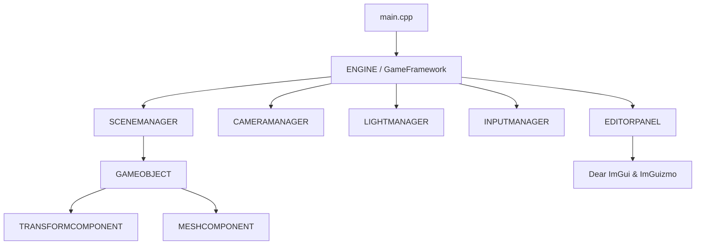

# Custom 3D Engine & Graphics Editor Specification

본 문서는 C++ 및 Raw OpenGL 3.3을 기반으로 자체 제작된 3D 그래픽스 렌더링 엔진의 핵심 아키텍처, 수학적 물리 연산 구현부 및 시스템 컴포넌트들에 대한 상세 기술 사양서입니다. 

---

## 1. 🏗️ 전체 엔진 아키텍처 및 메인 루프 (Core Architecture)

엔진은 싱글톤 매니저 클래스들과 컴포넌트 기반 오브젝트 구조(Entity-Component System)로 유기적으로 설계되어 있습니다.



### 1) GameFramework & ENGINE (`main.cpp`, `Engine.h/cpp`)
GLFW 윈도우 컨텍스트 생성을 시작으로, 렌더링 파이프라인의 프레임 조율과 시스템 전반의 라이프사이클을 감독하는 중앙 커널입니다.
* **FHD 해상도 강제**: 포트폴리오 최적화 해상도인 `1920x1080` 창 크기로 GLFW 컨텍스트를 기동합니다.
* **업데이트/렌더링 분리**: 매 프레임 시간차인 `delta_time`을 계산하여 입력 처리 ➡️ 로직 업데이트(`update()`) ➡️ 지연 업데이트(`late_update()`) ➡️ 화면 클리어 및 3D 렌더링 ➡️ UI 렌더링 ➡️ 버퍼 스왑 순서로 엄격하게 루프를 순환합니다.

### 2) 셰이더 바인딩 (`Shader.h/cpp`)
GLSL 셰이더 파일 컴파일, 링크 및 GPU 레지스터로의 유니폼 변수 전송을 담당합니다.
* **행렬 및 벡터 바인딩 최적화**: 셰이더에 내장된 유니폼 레지스터로 `glm::mat4`, `glm::vec3`, `float` 등의 형식을 `glUniformMatrix4fv`, `glUniform3fv` 등의 OpenGL 기본 명령을 래핑하여 호출 시 실시간으로 바인딩합니다.

---

## 2. 👑 매니저 레이어 (Singleton Managers)

모든 매니저 클래스는 글로벌 상태 오염을 방지하고 프레임워크 전반의 통일성을 지키기 위해 **스레드 안전한 Meyers의 싱글톤 패턴**을 준수합니다.

```cpp
// 매니저 공통 싱글톤 선언 패턴
class MANAGER {
private:
    MANAGER() = default;
    ~MANAGER() = default;
    MANAGER(const MANAGER&) = delete;
    MANAGER& operator=(const MANAGER&) = delete;
public:
    static MANAGER& get_instance() {
        static MANAGER instance;
        return instance;
    }
};
```

### 1) SCENEMANAGER (`SceneManager.h/cpp`)
* **역할**: 게임 오브젝트 수명 주기, 다중 선택 상태(Multi-Selection), 단축키 처리, 그리고 되돌리기(Undo) 스택을 한데 모아 관리합니다.
* **다중 선택 상태 설계**: 단일 포커스를 위한 `_selected_gameobject` 외에 다중 그룹 기즈모 조작을 위해 `std::vector<std::shared_ptr<GAMEOBJECT>> _selected_gameobjects`를 운용하며, 개별 선택 추가 및 제외 기능(`select_gameobject`, `deselect_gameobject`)을 지원합니다.
* **단축키 및 충돌 처리**: `update()` 단계에서 ImGui 가 텍스트 입력을 점유하고 있지 않을 때(`!ImGui::GetIO().WantTextInput`) `QWER` 도구 변경, `Delete` 선택 객체 파괴, `Ctrl + Z` 언두 롤백 입력을 실시간으로 필터링하고 수행합니다.

### 2) CAMERAMANAGER (`CameraManager.h/cpp`)
카메라 공간(View Space)과 투영 변환(Projection Matrix)을 수치적으로 구현하며, 마우스 입력과 결합한 3D 비행 조작을 전담합니다.
* **3D 공간 광선 투영 (Screen Point To Ray)**:
  2D 화면 픽셀 좌표 $(x, y)$에서 3D 공간상의 시작점(Origin)과 방향(Direction) 광선을 복원하기 위해 다음과 같은 수학식 연산을 코드로 수행합니다.
  ```cpp
  // 1. NDC(Normalized Device Coordinates) 변환
  float ndc_x = (2.0f * x) / screen_width - 1.0f;
  float ndc_y = 1.0f - (2.0f * y) / screen_height;
  
  // 2. Homogeneous Clip Space 좌표 설정 (z = -1.0f는 Near Plane을 가리킴)
  glm::vec4 clip_ray = glm::vec4(ndc_x, ndc_y, -1.0f, 1.0f);
  
  // 3. Eye Space(View Space) 역투영
  glm::vec4 eye_ray = glm::inverse(projection_matrix) * clip_ray;
  eye_ray = glm::vec4(eye_ray.x, eye_ray.y, -1.0f, 0.0f); // 방향 벡터화
  
  // 4. World Space로 변환하여 최종 광선 방향 도출
  glm::vec3 world_ray_dir = glm::normalize(glm::vec3(glm::inverse(view_matrix) * eye_ray));
  glm::vec3 world_ray_origin = camera_position;
  ```
* **언리얼 스타일 비행 조작 (Flight Control)**:
  마우스 우클릭을 홀드하는 동안 시스템 마우스 커서를 완전히 숨기고 중앙에 강제 고정(`GLFW_CURSOR_DISABLED`)합니다. 요(Yaw)와 피치(Pitch)에 의해 시선이 360도로 회전하며, 이 상태에서만 `WASD / EQ(수직 상승 및 하강)` 입력이 활성화되어 비행할 수 있도록 키 입력을 격리합니다.
* **오브젝트 자동 집중 (Focus F Key)**:
  선택 대상이 존재할 때 `F` 키를 누르면, 타겟 오브젝트 중심의 로컬 AABB 크기에 기초한 안전거리(기본 3.0f)만큼 떨어진 45도 조감 시점으로 카메라 위치와 룩앳(LookAt) 대상을 보간 이동시킵니다.

### 3) LIGHTMANAGER (`LightManager.h/cpp`)
* **역할**: 씬 렌더링에 적용할 글로벌 라이팅 파라미터를 보관하는 데이터 컨테이너 싱글톤입니다.
* **기본 스펙**:
  * 디렉셔널 라이트 방향 (`_dir_light_direction`): X축 방향인 `(-1.0f, 0.0f, 0.0f)` (우측에서 좌측으로 일직선 조사).
  * 광원 컬러 (`_dir_light_color`): 부드러운 그린 계열 미색인 `(0.3f, 0.4f, 0.3f)`.
  * 광도 (`_dir_light_intensity`): `1.0f`.
  * 주변광 (`_ambient_light`): 씬의 극단적 그림자를 방지하는 화이트 주변광 `(1.0f, 1.0f, 1.0f)`.

---

## 3. 🧩 컴포넌트 시스템 (Component System)

모든 객체는 `GAMEOBJECT` 클래스의 인스턴스이며, 실시간 변환과 메시 표현은 장착된 컴포넌트들을 통해 처리됩니다.

### 1) TRANSFORMCOMPONENT (`TransformComponent.h/cpp`)
오브젝트의 3D 공간상의 위치, Euler 회전값, 스케일 수치를 결정하고 이를 결합하여 **Model Matrix**를 생성합니다.
* **오차 없는 행렬 재합성 (Recompose)**:
  일반적인 오일러 연산 체인은 짐벌 락(Gimbal Lock) 및 스케일 비선형 적용 등의 문제를 일으킵니다. 이를 방지하고자 ImGuizmo에서 가공된 4x4 매트릭스로부터 이동/회전/스케일 성분을 추출 및 복원할 때, 수학적 대칭이 성립하도록 `ImGuizmo::RecomposeMatrixFromComponents` 연산을 명시적으로 활용하여 행렬의 일관성을 유지합니다.

### 2) MESHCOMPONENT (`MeshComponent.h/cpp`)
기하학적 정점 데이터의 GPU VRAM 적재(VAO, VBO, EBO 바인딩)와 그리기 명령 호출을 전담합니다.
* **Normal 법선 레이아웃 추가**:
  기존 Position(0번), Color(1번) 레이아웃 구성에서 라이팅 셰이더 연산을 지원하기 위해 **Normal(2번)** 정점 레이아웃 정보를 GPU에 적절히 바인딩합니다.
  ```cpp
  // Normal attribute 지정 (VERTEX 구조체 내의 오프셋 기준)
  glEnableVertexAttribArray(2);
  glVertexAttribPointer(2, 3, GL_FLOAT, GL_FALSE, sizeof(VERTEX), (void*)offsetof(VERTEX, _normal));
  ```
* **프레임 유니폼 및 하이라이트 투하**:
  `render()` 메서드 호출 시, `LIGHTMANAGER` 및 `CAMERAMANAGER`로부터 실시간 조명 및 카메라 정보를 받아 유니폼 레지스터(`u_lightDir`, `u_lightColor`, `u_lightIntensity`, `u_ambientLight`, `u_viewPos`)에 바인딩합니다. 오브젝트가 선택 리스트에 포함되어 있다면 `u_selected` 플래그 값을 1.0f로 세팅합니다.

### 3) GEOMETRYGENERATOR (`GeometryGenerator.h`)
삼각 메쉬 구조를 연산하기 위해 수학 공식을 사용해 실시간으로 기하 데이터를 파싱하는 정적 수학 모듈입니다. 조명의 공정한 감쇄를 관측하기 위해 모든 셰이프의 기본 색상은 **`(0.8f, 0.8f, 0.8f)`**의 라이트 그레이로 고정 세팅됩니다.
* **CUBE (큐브)**:
  * 6개 면에 독립적인 면 법선(Face Normal)을 부여하기 위해 동일한 모서리에 위치한 꼭짓점이라도 노멀 방향에 따라 면당 4개씩 총 **24개의 정점**을 분리 선언하여 플랫 셰이딩(Flat Shading)의 경계면 명암 표현을 칼같이 살려냅니다.
* **PYRAMID (삼각뿔)**:
  * 4개의 삼각형 빗면 법선벡터와 바닥 사각형 평면 법선벡터를 삼차원 탄젠트 외적 수학 공식으로 계산하여 하드 에지가 명확하게 렌더링되도록 정점을 분배합니다.
* **SPHERE (구체)**:
  * 극좌표각 $\theta$ (0 ~ $2\pi$)와 위도각 $\phi$ (0 ~ $\pi$)를 순회하며 삼각함수 좌표계를 실시간 생성합니다.
  * 구체의 표면 법선(Normal)은 구체 원점에서 해당 구면 좌표 정점으로 향하는 방향 벡터를 정규화(Normalize)한 값과 동일하므로, 매끄러운 셰이딩(Smooth Shading)을 실시간으로 도출합니다.
  $$\mathbf{N} = \text{normalize}(\mathbf{P}_{\text{vertex}} - \mathbf{O}_{\text{center}})$$

---

## 4. 셰이더 조명 및 하이라이트 연산 (Shader Shading)

조명 방정식은 Blinn-Phong 기법을 응용하여 디렉셔널 셰이더를 통해 픽셀단위(Per-Pixel) 명암으로 환산됩니다.

### 1) 버텍스 셰이더 (`cube.vs`)
```glsl
#version 330 core
layout (location = 0) in vec3 aPos;
layout (location = 1) in vec3 aColor;
layout (location = 2) in vec3 aNormal;

out vec3 ourColor;
out vec3 FragPos;
out vec3 Normal;

uniform mat4 model;
uniform mat4 view;
uniform mat4 projection;

void main()
{
    // 월드 공간의 픽셀 위치 연산
    FragPos = vec3(model * vec4(aPos, 1.0));
    
    // 비균등 스케일(Non-uniform scale) 변환 시 법선 유실을 방지하는 노멀 매트릭스 변환 적용
    Normal = mat3(transpose(inverse(model))) * aNormal;
    
    gl_Position = projection * view * model * vec4(aPos, 1.0);
    ourColor = aColor;
}
```

### 2) 프래그먼트 셰이더 (`cube.fs`)
```glsl
#version 330 core
out vec4 FragColor;

in vec3 ourColor;
in vec3 FragPos;
in vec3 Normal;

uniform vec3 u_lightDir;
uniform vec3 u_lightColor;
uniform float u_lightIntensity;
uniform vec3 u_ambientLight;
uniform vec3 u_viewPos;
uniform float u_selected;

void main()
{
    vec3 norm = normalize(Normal);
    vec3 viewDir = normalize(u_viewPos - FragPos);
    
    // 광원 방향 역산
    vec3 lightDir = normalize(-u_lightDir);
    
    // 1. Ambient (주변광)
    vec3 ambient = u_ambientLight * ourColor;
    
    // 2. Diffuse (람베르트 코사인 확산광)
    float diff = max(dot(norm, lightDir), 0.0);
    vec3 diffuse = diff * u_lightColor * u_lightIntensity * ourColor;
    
    // 3. Specular (Blinn-Phong 하프-하프 반사광)
    vec3 halfwayDir = normalize(lightDir + viewDir);
    float spec = pow(max(dot(norm, halfwayDir), 0.0), 32.0);
    vec3 specular = spec * u_lightColor * u_lightIntensity * 0.4;
    
    // 조명 합산
    vec3 resultColor = ambient + diffuse + specular;
    
    // 4. Selection Outline Highlight (선택 강조 효과)
    if (u_selected > 0.5) {
        // 따뜻한 금색 하이라이트를 40% 강도로 블렌딩
        resultColor = mix(resultColor, vec3(1.0, 0.9, 0.0), 0.4);
    }
    
    FragColor = vec4(resultColor, 1.0);
}
```

---

## 5. 🎛️ 에디터 인터페이스 및 기즈모 조작 (UI & Manipulation)

`Core/EditorPanel.cpp`에서 구현된 GUI 시스템은 스크린 스페이스 연산과 기즈모 행렬 보간을 극대화하여 조작 편의를 끌어올립니다.

### 1) 좌측 도킹 윈도우 스택 (Docked Stack Layout)
가장 보편적인 상용 엔진 레이아웃 규격을 위해 가로 20% 공간을 도킹하고 이동을 제한합니다.
* **계산 공식**:
  $$\text{Panel Width} = \text{GLFW Window Width} \times 0.20$$
  $$\text{Toolbox Height} = \text{GLFW Height} \times 0.40, \quad \text{Hierarchy} = \text{GLFW Height} \times 0.25, \quad \text{Inspector} = \text{GLFW Height} \times 0.35$$
* 이 값들을 매 프레임 `ImGui::SetNextWindowPos` 및 `SetNextWindowSize`에 `ImGuiCond_Always` 파라미터와 함께 넘겨주어, 사용자가 창의 핸들을 임의로 조정하지 않고도 도킹 상태가 창 크기 조정에 따라 완벽하게 맞물려 움직입니다.

### 2) 2D 사각형 드래그 박스 다중 선택 (Box Selection)
빈 화면 영역에 마우스 좌클릭 상태로 드래그를 가할 때 작동하는 다중 충돌 수집 메커니즘입니다.
* **2D 드로잉**: ImGui 전면 포그라운드 리스트에 `AddRectFilled`(알파 채널 15% 반투명 박스) 및 `AddRect`(테두리선)를 인젝션합니다.
* **다중 투영 수집**: 드래그를 종료하는 릴리즈 시점에 화면 가로세로 박스의 최소/최대 영역을 픽셀 단위로 설정하고, 씬 안의 기하 오브젝트 위치 벡터를 앞서 소개된 `world_to_screen` 변환식을 사용해 평면 사각형 안에 속하는 대상을 일괄 연산합니다.
* **누적 추가**: 드래그 수집 시 `Shift` 키가 홀드되어 있는 상태라면, 기존 선택 컨테이너 요소를 지우지 않고 신규 검출된 객체들을 순차 추가(`select_gameobjects`)합니다.

### 3) 다중 기즈모 오빗 회전 조작 (Orbit Rotation)
여러 객체가 동시 선택되어 기즈모 핸들이 생성되었을 때 수행되는 월드 피벗 기반의 상대 오빗(Orbit) 이동 및 스케일 연산입니다.
* **기준 피벗**: 선택된 모든 오브젝트 좌표들의 평균 벡터값으로 가상의 월드 축 좌표인 `pivot`을 연산합니다.
  $$\mathbf{P}_{\text{pivot}} = \frac{1}{N} \sum_{i=1}^{N} \mathbf{P}_{i}$$
* **임시 그룹 행렬**: 이 `pivot`을 기준으로 이동 성분만 존재하는 4x4 행렬을 빌드하고 `ImGuizmo::Manipulate`를 수행합니다.
* **조작 데이터 복원 및 회전 각도 Orbit 계산**:
  드래그로 인해 변형된 행렬로부터 추출된 이동 델타(`delta_pos`), 회전 델타(`delta_rot`), 스케일 델타(`delta_scale`)는 각 컴포넌트에 다음과 같이 누적 적용됩니다.
  * **이동**: $\mathbf{P}_{i} \leftarrow \mathbf{P}_{i} + \delta_{\text{pos}}$
  * **스케일 (안정성 적용)**: 프레임 누적 증폭 버그 방지를 위해 드래그를 트리거한 최초 시점의 스냅샷 크기에 현재 드래그 누적 절대 배율을 직접 대입하여 스케일 발산(`inf`)을 근본적으로 차단합니다.
    $$\mathbf{S}_{i} \leftarrow \mathbf{S}_{\text{snapshot}, i} \times \mathbf{S}_{\text{current\_gizmo}}$$
  * **회전 (Orbit)**: 개체 자전각에 델타 회전각을 더함과 동시에, 기준 피벗점으로부터 개체가 떨어져 있는 오프셋 거리 벡터를 해당 회전축 행렬식에 연산하여 공전시킵니다.
    $$\mathbf{P}_{i} \leftarrow \mathbf{P}_{\text{pivot}} + \mathbf{R}(\delta_{\text{rot}}) \times (\mathbf{P}_{i} - \mathbf{P}_{\text{pivot}})$$

---

## 6. 🔄 트랜잭션 되돌리기 파이프라인 (Undo System)

시스템 동작 전반에 대한 롤백 기능을 위해 정형화된 커맨드 패턴(Command Pattern) 스택 아키텍처를 도입했습니다.

### 1) 트랜잭션 단위 추상화 (`COMMAND` Interface)
* `SPAWNCOMMAND`: 오브젝트의 메모리 소멸 및 씬 관리 릴리즈 상태를 원래 스폰된 상태로 되돌립니다.
* `DELETECOMMAND`: 월드에서 제거되어 삭제되었던 오브젝트 리스트를 컴포넌트 데이터 손실 없이 그대로 구조를 보전하여 월드 배열에 재배치하고 포커싱합니다.
* `TRANSFORMCOMMAND`: 다중 오브젝트 조작 이전의 위치, 회전, 스케일 수치를 스냅샷 벡터(`TransformSnapshot`) 형태로 포장 보관하여 이전 상태로 값들을 덮어씁니다.

### 2) 기즈모 단일 롤백 트랜잭션 락킹 (Drag Boundary Lock)
마우스를 드래그하는 도중 실시간으로 스냅샷을 밀어넣으면 수백 개의 쓸모없는 언두 노드가 생깁니다. 이를 최적화하기 위해 바운더리 검사를 다음과 같이 구현했습니다.
* **드래그 진입 시점 (`ImGuizmo::IsUsing() == true` && `was_using_gizmo == false`)**:
  선택된 대상들의 현재 Transform 정보를 일제히 `drag_snapshots` 벡터에 담아 보관합니다.
* **드래그 종료 시점 (`ImGuizmo::IsUsing() == false` && `was_using_gizmo == true`)**:
  드래그가 정지했으므로 보관 중이던 `drag_snapshots`를 매개변수로 하여 하나의 `TRANSFORMCOMMAND`를 동적 생성하고 `push_undo_command`에 격리 밀봉해 적재합니다.

---

### 📂 컴포넌트별 소스 참조 경로
* **Core Loop & Context**: [Engine.cpp](file:///C:/Users/ckswl/Desktop/OpenGL/OpenGL_Graphics/OpenGL_Graphics/Core/Engine.cpp) / [GameFramework.cpp](file:///C:/Users/ckswl/Desktop/OpenGL/OpenGL_Graphics/OpenGL_Graphics/Core/GameFramework.cpp)
* **Managers Singleton**: [SceneManager.cpp](file:///C:/Users/ckswl/Desktop/OpenGL/OpenGL_Graphics/OpenGL_Graphics/Managers/SceneManager.cpp) / [CameraManager.cpp](file:///C:/Users/ckswl/Desktop/OpenGL/OpenGL_Graphics/OpenGL_Graphics/Managers/CameraManager.cpp) / [LightManager.cpp](file:///C:/Users/ckswl/Desktop/OpenGL/OpenGL_Graphics/OpenGL_Graphics/Managers/LightManager.cpp)
* **Entities & Components**: [GameObject.h](file:///C:/Users/ckswl/Desktop/OpenGL/OpenGL_Graphics/OpenGL_Graphics/Entities/GameObject.h) / [TransformComponent.cpp](file:///C:/Users/ckswl/Desktop/OpenGL/OpenGL_Graphics/OpenGL_Graphics/Components/TransformComponent.cpp) / [MeshComponent.cpp](file:///C:/Users/ckswl/Desktop/OpenGL/OpenGL_Graphics/OpenGL_Graphics/Components/MeshComponent.cpp)
* **Geometry Engine**: [GeometryGenerator.h](file:///C:/Users/ckswl/Desktop/OpenGL/OpenGL_Graphics/OpenGL_Graphics/Components/GeometryGenerator.h)
* **GLSL Shader Compiler**: [Shader.cpp](file:///C:/Users/ckswl/Desktop/OpenGL/OpenGL_Graphics/OpenGL_Graphics/Core/Shader.cpp)
* **Workspace Shaders**: [cube.vs](file:///C:/Users/ckswl/Desktop/OpenGL/OpenGL_Graphics/OpenGL_Graphics/Shaders/cube.vs) / [cube.fs](file:///C:/Users/ckswl/Desktop/OpenGL/OpenGL_Graphics/OpenGL_Graphics/Shaders/cube.fs)
* **UI Controls & Gizmos**: [EditorPanel.cpp](file:///C:/Users/ckswl/Desktop/OpenGL/OpenGL_Graphics/OpenGL_Graphics/Core/EditorPanel.cpp)
* **Undo Engine**: [Command.cpp](file:///C:/Users/ckswl/Desktop/OpenGL/OpenGL_Graphics/OpenGL_Graphics/Core/Command.cpp)
