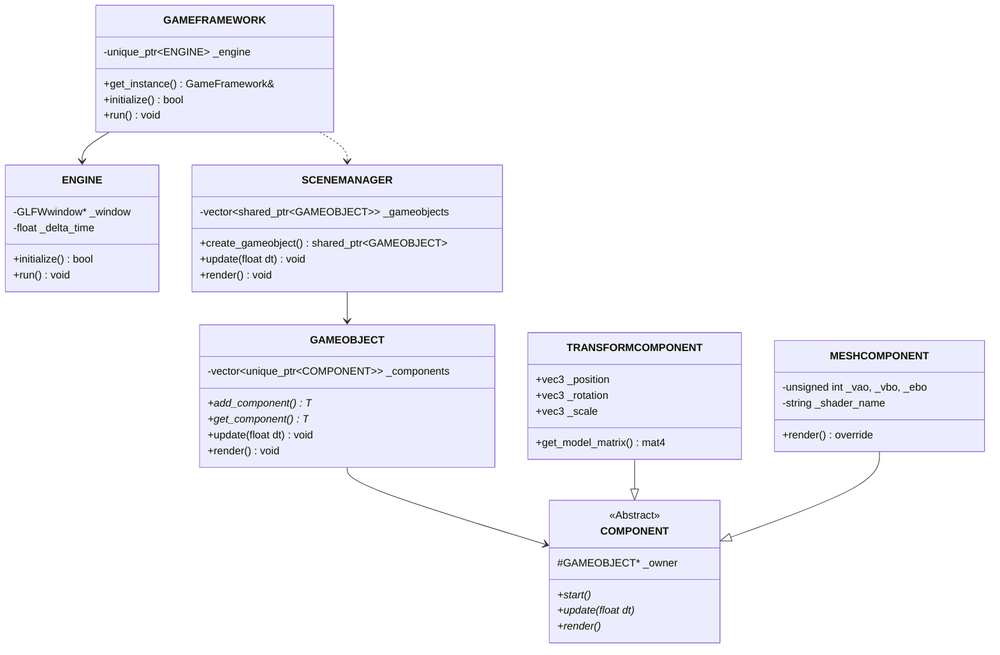

# 🎨 OpenGL Renderer Project Roadmap & Design Specification

본 문서는 Unity Engine의 **GameObject-Component 아키텍처**를 벤치마킹하여 구현 중인 **C++ OpenGL 렌더링 엔진**의 현재 상태 분석과 향후 기능 확장(Lighting, PBR, Asset Placement, Scene Editor 등)을 위한 설계 및 개발 로드맵을 정의합니다.

---

## 📌 1. 현재 구현 상태 분석 (Current Status)

현재 프로젝트는 기본적인 게임 루프 및 ECS(Entity-Component-System)와 유사한 GameObject-Component 아키텍처가 뼈대를 이루고 있습니다.



* **Core Engine & Framework**: GLFW와 GLEW를 활용하여 컨텍스트 초기화, FPS 계산, 입력 처리(`INPUTMANAGER`), 카메라 상태 관리(`CAMERAMANAGER`)를 수행합니다.
* **GameObject-Component**: Unity와 유사하게 `GAMEOBJECT`가 여러 `COMPONENT`를 소유하고 라이프사이클(`start`, `update`, `late_update`, `render`, `end`)을 순회합니다.
* **Rendering & Resources**: `RESOURCEMANAGER`가 셰이더 프로그램을 관리하며, `MESHCOMPONENT`를 통해 단순한 Rainbow Cube를 그리고 있습니다.

---

## 🚀 2. 핵심 고도화 로드맵 (Roadmap)

나중에 Lighting, PBR 및 에셋 배치가 가능한 실제 엔진으로 거듭나기 위해 다음과 같은 단계적 개발을 제안합니다.

### 📅 Phase 1: 리소스 및 에셋 파이프라인 (Asset Pipeline)
실제 3D 모델 및 재질을 불러오기 위한 기반을 구축합니다.
* **모델 로더 도입 (Assimp Integration)**:
  - `.obj`, `.fbx`, `.gltf` 형식의 3D 에셋을 로드하는 `ModelLoader` 구현.
  - 노드 계층(Node Hierarchy)을 분석하여 Mesh 데이터를 추출하고 복수의 서브 메쉬를 처리할 수 있도록 `MESHCOMPONENT` 확장.
* **텍스처 파이프라인 구축 (stb_image)**:
  - Diffuse, Normal, Metallic-Roughness 텍스처를 지원하도록 텍스처 매핑 구현.
  - `TEXTURE2D` 리소스를 관리하는 구조 추가.

### 📅 Phase 2: 다중 광원 및 그림자 시스템 (Lighting & Shadows)
렌더러의 시각적 퀄리티를 향상시키기 위해 기본 조명 모델과 그림자를 설계합니다.
* **Blinn-Phong Lighting 모델 구현**:
  - `LightComponent`를 제작하여 `GAMEOBJECT`에 붙일 수 있도록 설계 (Unity의 Light Component 구조).
  - **Directional Light, Point Light, Spot Light**를 셰이더에서 동적으로 수집하고 바인딩할 수 있는 `LightingManager` 도입.
* **Shadow Mapping**:
  - Point/Directional 광원에 대한 Depth Map 생성용 FBO(Frame Buffer Object) 구현.
  - 야외 씬을 위한 **Cascade Shadow Mapping (CSM)** 도입.

### 📅 Phase 3: PBR (Physically Based Rendering) & IBL
현대적인 3D 그래픽스의 표준인 PBR을 탑재합니다.
* **Cook-Torrance BRDF 셰이더 작성**:
  - 미세면 분포 함수(D - Trowbridge-Reitz GGX), 기하학적 감쇄 함수(G - Smith), 프레넬 방정식(F - Schlick) 적용.
  - 재질을 정의하는 `PBRMaterialComponent` 설계 (Albedo, Normal, Metallic, Roughness, AO 텍스처 맵 대응).
* **IBL (Image-Based Lighting)**:
  - HDRI 이미지를 파싱하여 Skybox(Cubemap)로 렌더링.
  - 간접 조명(Ambient / Global Illumination) 표현을 위한 Irradiance Map(diffuse)과 Pre-filter Env Map / BRDF LUT(specular) 사전 계산 파이프라인 개발.

### 📅 Phase 4: 씬 관리 및 직렬화 (Scene & Serialization)
유니티처럼 에셋을 배치하고 이를 저장/로드하는 시스템입니다.
* **Scene Serialization (JSON / YAML)**:
  - 현재 씬 상태(모든 GameObject의 이름, 활성화 여부, 하위 컴포넌트 데이터 정보)를 텍스트 파일로 저장하고 불러오는 `SceneSerializer` 구현.
  - 예시: Unity의 `.unity` 파일처럼 계층적 컴포넌트 정보 보존.
* **노드 계층 구조(Hierarchy) 구현**:
  - 부모-자식 관계(`TransformComponent` 간의 `parent`, `children` 계층 구조)를 추가하여 Local Space와 World Space 변환 연산 구현.

### 📅 Phase 5: GUI 에디터 및 에셋 배치 기능 (Editor & Interaction)
에셋 배치 등 엔진다운 툴을 사용할 수 있도록 UI 레이어를 통합합니다.
* **Dear ImGui 통합**:
  - 게임 뷰포트(Viewport)와 에디터 UI 영역의 분리.
  - **Hierarchy Panel**: 씬에 배치된 오브젝트 계층 출력.
  - **Inspector Panel**: 선택된 오브젝트의 Transform 수정, Component 추가/제거 및 값 실시간 변경.
  - **Project/Asset Browser Panel**: 리소스 폴더에 위치한 파일 리스팅 및 드래그 앤 드롭 준비.
* **마우스 픽킹 (Mouse Picking) & Gizmo**:
  - 화면 마우스 클릭 좌표를 World Ray로 변환하여 에셋을 선택하는 Raycasting 충돌 검사 구현.
  - ImGuizmo 오픈소스 라이브러리를 연동하여 에디터 뷰포트에서 직접 Transform(이동, 회전, 스케일 기즈모) 조작 지원.

---

## 🛠️ 3. 추천 아키텍처 설계 (Unity Reference Structure)

Unity 구조를 벤치마킹할 때, C++ 환경에서 아래와 같이 컴포넌트 그룹을 확장하는 것을 추천합니다.

```
OpenGL_Graphics/
├── Components/
│   ├── Component.h (기본 추상 클래스)
│   ├── TransformComponent.h (위치/회전/크기 및 부모-자식 행렬 계산)
│   ├── MeshRenderer.h (Mesh 및 Material 정보 보유)
│   ├── Light.h (Directional/Point/Spot 광원 컴포넌트)
│   └── Camera.h (씬 카메라 제어 컴포넌트, 현재 CameraManager의 분산화 가능)
├── Core/
│   ├── Engine.h / Engine.cpp
│   ├── GameFramework.h / GameFramework.cpp
│   └── Material.h (Shader, Texture, Uniform 속성을 포함하는 재질 클래스)
├── Managers/
│   ├── SceneManager.h (현재 로드된 Active Scene 제어)
│   ├── ResourceManager.h (Shader, Mesh, Texture 캐싱 및 수명 관리)
│   └── RenderPipeline.h (Forward/Deferred 렌더링 루프 제어)
```

> [!TIP]
> **성능 최적화 팁**
> 향후 복잡한 에셋 배치가 늘어날 경우, 각 MeshComponent가 개별적으로 Draw Call을 호출하면 드로우 콜 병목이 발생할 수 있습니다. 동일한 재질을 공유하는 경우 **인스턴싱(Instanced Rendering)**을 지원할 수 있도록 `MeshRenderer`를 구성하는 편이 유리합니다.

> [!IMPORTANT]
> **컴포넌트 수명 주기 주의**
> 컴포넌트를 동적으로 해제하거나 삭제할 때, `SCENEMANAGER`나 각 오브젝트 소유의 벡터 내에서 스마트 포인터가 적절히 정리되지 않으면 댕글링 포인터 혹은 메모리 누수가 발생할 수 있습니다. 씬 초기화(Clear) 로직을 주기적으로 점검하세요.

---

## 🗂️ 4. 참고용 Skill & References

이 리포지토리의 `.agents/skills` 경로로 다음과 같은 전문 GPU 및 게임 엔진 지식 기반이 추가되었습니다. 이 파일들은 AI 어시스턴트(Antigravity)가 여러분의 코드 작성을 돕고 조언을 제공할 때 강력한 도메인 지식 가이드라인으로 작용합니다.

1. **`shader-programming`**: GPU 실행 모델, GLSL 코드 최적화 및 셰이더 에러 조치 가이드.
2. **`lighting-design`**: 실시간 라이팅, 그림자 최적화, 포스트 프로세싱 및 HDR 설정 조언.
3. **`unity-development`**: 씬 계층 관리, 컴포넌트 라이프사이클 설계 및 에디터 개발 레퍼런스.
4. **`game-development`**: 프레임레이트 관리, 입력 루프 및 고성능 핵심 루프 최적화 노하우.
